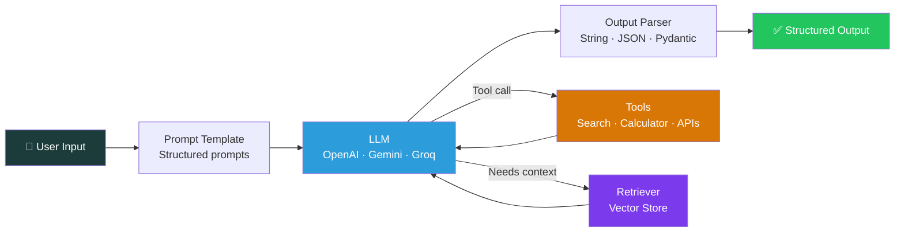
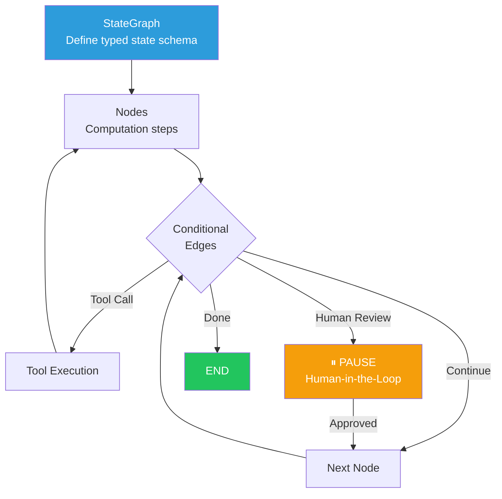
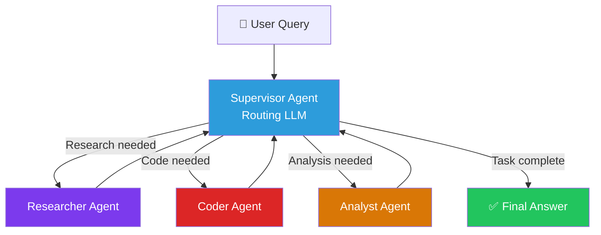
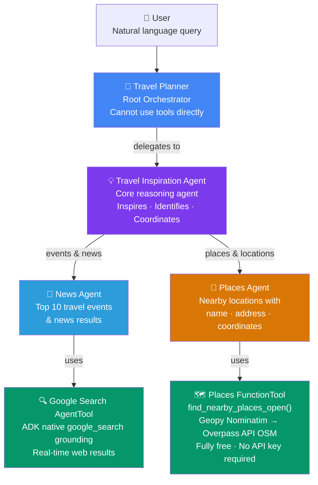
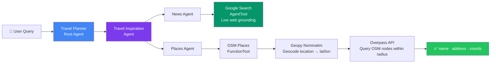
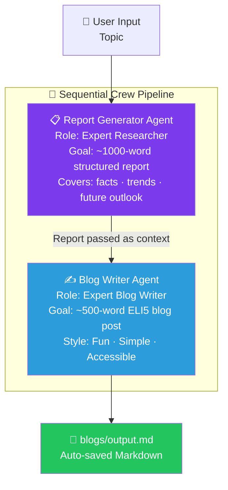
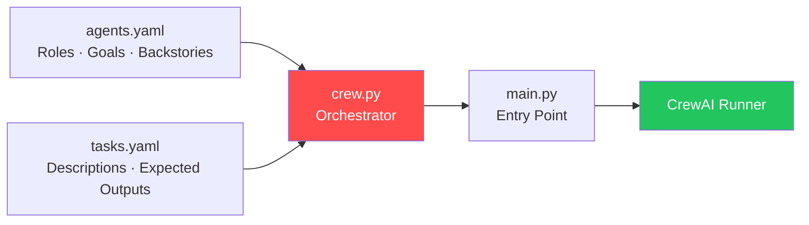
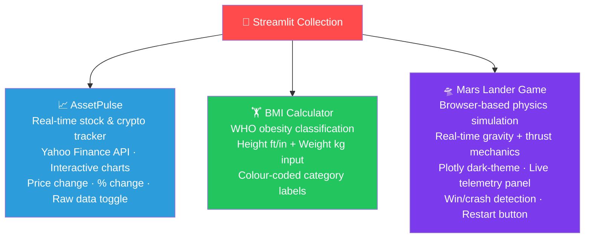
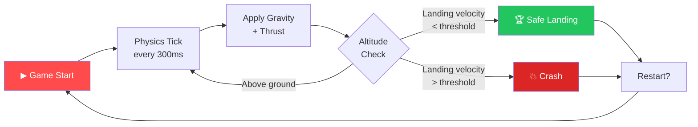
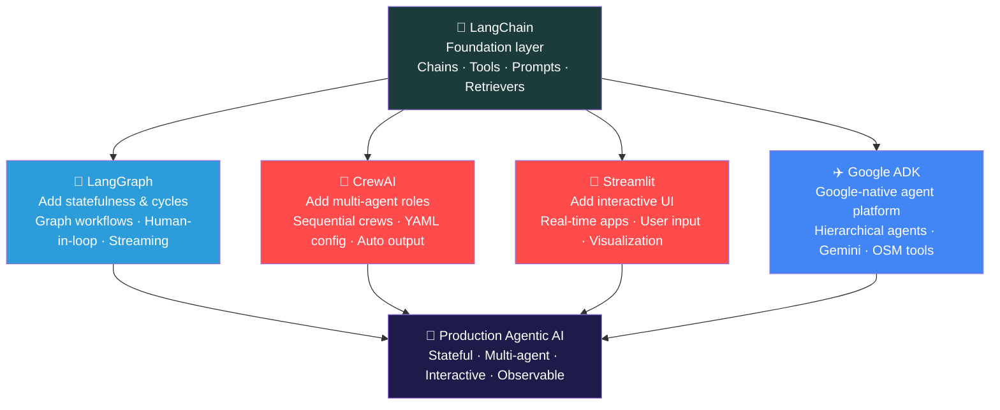

<div align="center">

#  Agentic-AI-Frameworks

### A curated collection of production-grade Agentic AI implementations across LangGraph, CrewAI, LangChain, Streamlit & Google ADK

[](https://python.org)
[](https://langchain.com)
[](https://langchain-ai.github.io/langgraph)
[](https://crewai.com)
[](https://streamlit.io)
[](https://google.github.io/adk-docs/)
[](LICENSE)

*Five distinct agentic AI frameworks — from graph-based agent orchestration to multi-agent collaboration and Google's native agent platform — each solving a different dimension of autonomous AI system design.*

</div>

---

## 📌 Table of Contents

- [Overview](#-overview)
- [Framework Comparison](#-framework-comparison)
- [Project Index](#-project-index)
  - [LangChain](#1--langchain)
  - [LangGraph](#2--langgraph)
  - [Google ADK](#3--google-adk)
  - [CrewAI](#4--crewai)
  - [Streamlit](#5--streamlit)
- [Tech Stack](#-tech-stack)
- [Agentic AI Evolution Map](#-agentic-ai-evolution-map)
- [Author](#-author)

---

## 🔍 Overview

**Agentic-AI-Frameworks** is a systematic exploration of the modern agentic AI ecosystem. Each project in this collection tackles a different architectural challenge — from stateful graph-based agent workflows and multi-agent collaboration pipelines to LLM chain fundamentals and interactive AI-powered UIs.

This repository serves as both a **reference library** and a **portfolio of applied agentic AI engineering**.

```
Agentic-AI-Frameworks/
├── langchain/       # LLM chains, tools, and prompt engineering
├── langgraph/       # Graph-based stateful agent workflows (10 modules)
├── google-adk/      # Multi-agent travel planner — Google ADK + Gemini
├── crew-ai/         # Multi-agent research & blog writing pipeline
└── streamlit/       # Interactive AI-powered web applications
```

---

## 📊 Framework Comparison

| Feature | LangGraph | CrewAI | LangChain | Streamlit | Google ADK |
|---|---|---|---|---|---|
| **Primary Use** | Stateful agent graphs | Multi-agent collaboration | LLM chains & tools | Interactive AI UIs | Native Google agent platform |
| **Agent Type** | Single/Multi-agent | Role-based agents | Tool-using chains | UI layer | Hierarchical sub-agents |
| **Memory/State** | ✅ Full state graph | ✅ Context passing | ⚠️ Limited | ❌ Session only | ✅ ADK managed |
| **Human-in-Loop** | ✅ Native support | ⚠️ Limited | ❌ | ✅ Via UI | ⚠️ Limited |
| **Multi-Agent** | ✅ Supervisor pattern | ✅ Core feature | ❌ | ❌ | ✅ Native hierarchy |
| **Streaming** | ✅ Token + event | ⚠️ Limited | ✅ | ✅ | ✅ |
| **LLM Support** | OpenAI, Gemini, Groq | Gemini, OpenAI | All major LLMs | Any backend | Gemini (native) |
| **Complexity** | Advanced | Intermediate | Beginner–Advanced | Beginner | Intermediate |

---

## 📁 Project Index

---

### 1. 🔗 LangChain

> **The foundation — LLM chains, prompt engineering, tools, and retrieval primitives.**

A structured learning repository covering LangChain's core building blocks. From prompt templates and output parsers to tool-calling and retrieval chains — the fundamentals that power everything in this vault.

**→ Repository:** [LangChain](https://github.com/a-r-ashik/LangChain)

#### LangChain Ecosystem



#### Stack
`LangChain` · `OpenAI` · `Google Gemini` · `Groq` · `ChromaDB` · `FAISS` · `python-dotenv`

---

### 2. 🔷 LangGraph

> **Graph-based agent orchestration — the most powerful way to build stateful, cyclical AI workflows.**

A hands-on learning journey through LangGraph's core concepts and real-world agent systems. Covers 10 progressive modules from basic graph primitives to full multi-agent architectures with human-in-the-loop patterns.

**→ Repository:** [LangGraph](https://github.com/a-r-ashik/LangGraph)

#### 10 Modules Covered

| # | Module | Key Concept |
|---|---|---|
| 1 | Introduction | StateGraph, nodes, edges, entry/finish points |
| 2 | Basic Reflection System | Generate → Reflect loops with conditional edges |
| 3 | Reflexion Agent | Self-critique with tool feedback, episodic memory |
| 4 | State System | TypedDict schemas, reducers, checkpointing |
| 5 | ReAct Agent | Reasoning + Acting loop with tool execution |
| 6 | Chatbots | Persistent memory via SqliteSaver, multi-session |
| 7 | Human in the Loop | Pause/resume execution, approval workflows |
| 8 | RAG Agent | Graph-based retrieval with conditional routing |
| 9 | Multi-Agent Architecture | Supervisor pattern, specialist agent delegation |
| 10 | Streaming | Token-level & event-level streaming, responsive UIs |

#### Core Architecture



#### Multi-Agent Supervisor Pattern



#### Stack
`LangGraph 0.3.21` · `LangChain 0.3.18` · `OpenAI GPT-4o` · `Google Gemini` · `Groq` · `LangSmith` · `SQLite Checkpointing` · `Jupyter`

---

### 3. ✈️ Google ADK

> **Google's native agent platform — a hierarchical multi-agent travel planner powered by Gemini, Google Search, and OpenStreetMap.**

A production-grade multi-agent travel planning system built with **Google Agent Development Kit (ADK)**. Orchestrates specialized AI sub-agents to deliver destination inspiration, real-time travel news, and nearby place discovery — all in one seamless conversation. Uses **zero paid third-party APIs** for place search — powered entirely by OpenStreetMap and Nominatim.

**→ Repository:** [Google-ADK](https://github.com/a-r-ashik/Google-ADK)

#### Multi-Agent Architecture



#### Agent Roles

| Agent | Role | Tools |
|---|---|---|
| **Travel Planner** | Root orchestrator — delegates to sub-agents, cannot call tools directly | — |
| **Travel Inspiration Agent** | Core reasoning — inspires destinations, coordinates News & Places agents | `AgentTool(news_agent)`, `AgentTool(places_agent)` |
| **News Agent** | Fetches real-time travel events, news, and advisories (up to 10 results) | `google_search_grounding` |
| **Places Agent** | Returns nearby hotels, cafés, attractions with name, address & coordinates | `location_search_tool` |

#### Tool Architecture



#### Example Interactions

```
User: "I want a beach holiday in Saint Martin"
  └─▶ Travel Planner
        └─▶ Travel Inspiration Agent
              ├─▶ News Agent   → Top 10 events & news in Saint Martin
              └─▶ Places Agent → Hotels & resorts near Orient Bay Beach

User: "Find restaurants near Grand Case, Saint Martin"
  └─▶ Travel Planner
        └─▶ Travel Inspiration Agent
              └─▶ Places Agent → OSM: restaurants within 3km of Grand Case
```

#### Stack
`Google ADK ≥1.33.0` · `Gemini Flash` · `Google Search Grounding` · `Geopy Nominatim` · `Overpass API (OSM)` · `UV` · `Python 3.12+`

---

### 4. 🤝 CrewAI

> **Multi-agent collaboration — specialized agents working in sequence to research and write autonomously.**

A production-style CrewAI project that orchestrates two autonomous AI agents: a **Report Generator** that conducts deep research and a **Blog Writer** that transforms it into an accessible ELI5-style blog post. Output is auto-saved as a `.md` file — ready to publish.

**→ Repository:** [Crew-AI](https://github.com/a-r-ashik/Crew-AI)

#### Agent Pipeline



#### YAML-Driven Configuration



#### Sample Output
Generated blog topic: *"AI Engineering Career Path and Opportunities in Bangladesh 2026"*
- Covers Smart Bangladesh initiative, career specializations, hiring industries, and a beginner's roadmap
- Saved automatically to `blogs/ai_engineering_career_path.md`

#### Roadmap
- [ ] Add web search tool (Tavily) to the researcher agent
- [ ] Add Streamlit UI for live topic input and output display
- [ ] Add a third **Editor Agent** for fact-checking and refinement
- [ ] Integrate LangGraph for conditional agent routing

#### Stack
`CrewAI 1.13.0` · `Google Gemini` · `UV Package Manager` · `YAML Config` · `Python 3.10+`

---

### 5. 🎨 Streamlit

> **Interactive AI-powered web apps — bringing AI backends to life with clean, responsive UIs.**

A collection of three Streamlit applications demonstrating how to build real-time, interactive interfaces. Covers live data fetching, physics simulation, and health calculators — all deployable with a single command.

**→ Repository:** [Started\_with\_Streamlit](https://github.com/a-r-ashik/Started_with_Streamlit)

#### Three Apps



#### Mars Lander Game — Physics Loop



#### Stack
`Streamlit` · `yfinance` · `Plotly` · `pandas` · `streamlit-autorefresh` · `Python 3.8+`

---

## 🛠 Tech Stack

| Layer | Technologies |
|---|---|
| **Agent Orchestration** | LangGraph 0.3.21, CrewAI 1.13.0, Google ADK ≥1.33.0 |
| **LLM Framework** | LangChain 0.3.18 |
| **LLM Models** | OpenAI GPT-4o, Google Gemini 2.0/2.5/Flash, Groq LLaMA 3.3 70B |
| **State & Memory** | LangGraph SQLite Checkpointing, CrewAI context passing, ADK managed state |
| **Vector Stores** | ChromaDB, FAISS |
| **UI Framework** | Streamlit, Google ADK Web UI |
| **Data Visualization** | Plotly |
| **Observability** | LangSmith tracing |
| **Geospatial** | Geopy Nominatim, Overpass API (OpenStreetMap) |
| **Package Management** | UV, pip, venv |
| **Config** | YAML, python-dotenv |

---

## 🗺 Agentic AI Evolution Map



Each framework is a deliberate step in mastering a different dimension of the agentic AI design space.

---

## 👤 Author

**Ashikur Rahman**

[](https://github.com/a-r-ashik)

---

> *Also check out **[RAG-Vault](https://github.com/a-r-ashik/RAG-Vault)** — a companion collection of 5 RAG implementations including Simple, Multimodal, Corrective, Vectorless RAG and RAGAS Evaluation.*

---

<div align="center">

*Built with curiosity, one agentic framework at a time.*

</div>
